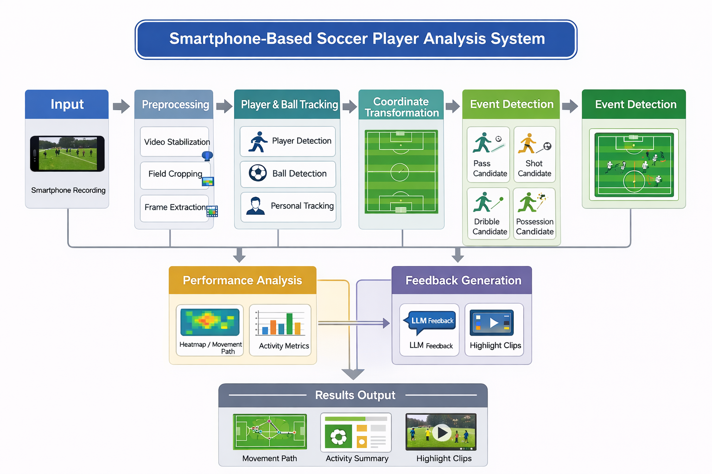

# Poket-Coach


스마트폰으로 촬영한 축구 영상을 기반으로 선수와 공을 추적하고, 경기 이벤트 및 활동량을 분석하여 사용자에게 피드백과 하이라이트 영상을 제공하는 캡스톤 프로젝트입니다.

## Offline Video Tracking Prototype

The offline human and ball tracking prototype created in this iteration now lives in `offline_video_tracking/`.

- Source code: `offline_video_tracking/`
- Usage guide: `offline_video_tracking/README.md`
- Quick run script: `offline_video_tracking/run_soccer_data_1.sh`

## Current Development Layout

The repository currently has three important development areas:

- `RealtimeDetectionMVP/`
  - Canonical iOS app project used by Xcode
  - This is the folder to edit when changing the running iPhone app
- `ios_mvp/`
  - Export scripts, model artifacts, setup notes, and MVP documentation
  - This folder is still used for tooling and docs
- `ios_mvp/RealtimeDetectionMVP/`
  - Template / mirror source kept for reference
  - Not the primary Xcode app source

If you are changing the live iOS app, use:

- `RealtimeDetectionMVP/RealtimeDetectionMVP.xcodeproj`
- `RealtimeDetectionMVP/RealtimeDetectionMVP/`

## Overview

아마추어 축구나 조기축구 환경에서는 전문 촬영 장비나 분석 시스템이 부족하여, 자신의 플레이를 객관적으로 기록하고 분석하기 어렵습니다.  
본 프로젝트는 **스마트폰 영상만으로 선수의 움직임, 공의 흐름, 주요 이벤트를 분석**하고, 이를 바탕으로 **활동 요약, 이동 경로, 하이라이트 클립, LLM 기반 피드백**을 제공하는 시스템을 목표로 합니다.

## Motivation

- 아마추어 선수들은 자신의 플레이를 정량적으로 분석하기 어렵습니다.
- 전문 분석 시스템은 비용이 높고 설치가 복잡합니다.
- 스마트폰은 접근성이 높아 누구나 쉽게 촬영하고 활용할 수 있습니다.

따라서 본 프로젝트는 **저비용·고접근성 스포츠 분석 시스템**을 구현하여, 일반 사용자도 손쉽게 자신의 경기력을 확인할 수 있도록 하는 것을 목적으로 합니다.

## System Architecture



위 아키텍처는 전체 시스템 파이프라인을 나타냅니다.

1. **Input**  
   - 스마트폰으로 축구 경기 영상을 촬영합니다.

2. **Preprocessing**  
   - 영상 흔들림 보정(Video Stabilization)  
   - 경기장 영역 추출(Field Cropping)  
   - 프레임 단위 추출(Frame Extraction)

3. **Player & Ball Tracking**  
   - 선수 검출(Player Detection)  
   - 공 검출(Ball Detection)  
   - 특정 선수 추적(Personal Tracking)

4. **Coordinate Transformation**  
   - 영상 좌표를 축구장 평면 좌표계로 변환하여 선수 및 공의 위치를 정규화합니다.

5. **Event Detection**  
   - 패스, 슛, 드리블, 점유 등 주요 이벤트 후보를 탐지합니다.

6. **Performance Analysis**  
   - 히트맵(Heatmap)  
   - 이동 경로(Movement Path)  
   - 활동량 지표(Activity Metrics)

7. **Feedback Generation**  
   - 분석 결과를 바탕으로 LLM 기반 피드백 생성  
   - 주요 장면 하이라이트 클립 생성

8. **Results Output**  
   - 이동 경로 시각화  
   - 활동 요약 리포트  
   - 하이라이트 영상 출력

## Key Features

- 스마트폰 영상 기반 축구 분석
- 선수 및 공 검출/추적
- 경기장 좌표계 변환
- 패스/슛/드리블/점유 이벤트 탐지
- 히트맵 및 이동 경로 시각화
- 활동량 통계 제공
- LLM 기반 경기 피드백 생성
- 하이라이트 클립 자동 생성

## Expected Outputs

- **Movement Path**: 선수 이동 경로 시각화
- **Activity Summary**: 활동량 및 이벤트 요약
- **Highlight Clips**: 주요 장면 자동 편집 영상
- **LLM Feedback**: 플레이 스타일 및 개선점에 대한 자연어 피드백

## Tech Stack

### Vision / Video Processing
- Python
- OpenCV
- YOLO / Object Detection Model
- Tracking Algorithm (DeepSORT / ByteTrack 등)

### Analysis
- Coordinate Transformation
- Event Detection Logic
- Heatmap / Trajectory Visualization

### AI Feedback
- LLM 기반 경기 피드백 생성

### Frontend / Output
- Streamlit / Web Dashboard / Mobile App (예정)
- Highlight Clip Generation

## Project Workflow

```text
Smartphone Video
→ Preprocessing
→ Player/Ball Detection & Tracking
→ Coordinate Transformation
→ Event Detection
→ Performance Analysis
→ Feedback Generation
→ Results Output
